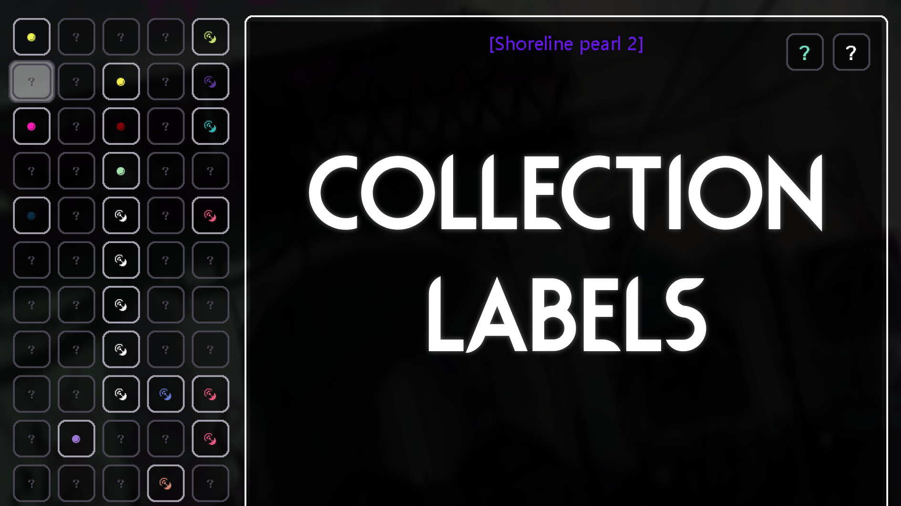

# Collection Labels

  
   
  (Steam Workshop: https://steamcommunity.com/sharedfiles/filedetails/?id=2944480166)

**Collection Labels** is a mod for Rain World which adds a name/location to each item in the Collections menu, for (mostly) spoiler-free collectible hunting!

## Installation:
1. Download the mod from the [Steam Workshop](https://steamcommunity.com/sharedfiles/filedetails/?id=2944480166).\
**OR:**
    1. Download the zip file from the [Releases](https://github.com/SabreML/CollectionLabels/releases) section.
    2. Move the `collectionlabels` folder from the zip file to `\Steam\steamapps\common\Rain World\RainWorld_Data\StreamingAssets\mods`.
2. Activate the mod in the in-game 'Remix' menu.

## Compatibility:
This mod was designed for Rain World Downpour v1.9.06+, and requires both 'Rain World Remix' and 'More Slugcats Expansion' to be enabled in the Remix menu.
